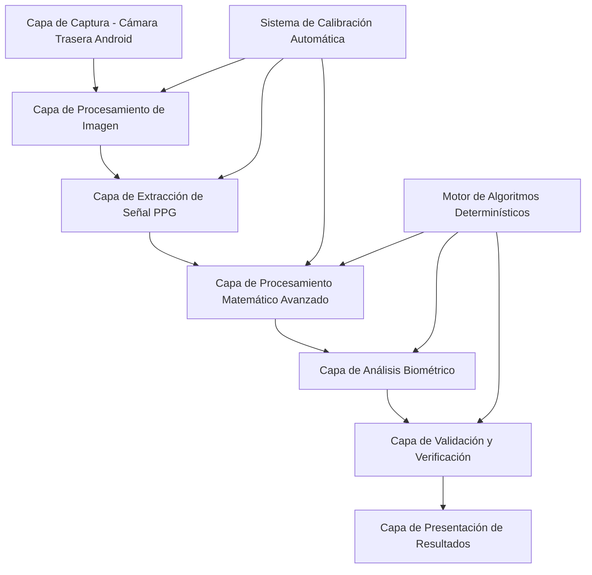

# Documento de Diseño - Sistema de Medición Biométrica Real sin Simulaciones

## Visión General

El sistema será completamente rediseñado para eliminar todas las simulaciones y implementar algoritmos matemáticos avanzados que procesen datos reales de la cámara trasera de Android. La arquitectura se basará en principios de procesamiento de señales biomédicas, óptica médica y algoritmos determinísticos de alta precisión.

## Arquitectura del Sistema

### Arquitectura de Capas



### Componentes Principales

1. **AndroidCameraController**: Control avanzado de cámara trasera
2. **RealTimeImageProcessor**: Procesamiento de imagen en tiempo real
3. **PPGSignalExtractor**: Extracción de señales PPG reales
4. **AdvancedMathEngine**: Motor de cálculos matemáticos complejos
5. **BiometricAnalyzer**: Analizador de parámetros biométricos
6. **DeterministicValidator**: Validador determinístico
7. **AutoCalibrationSystem**: Sistema de calibración automática

## Componentes y Interfaces

### 1. AndroidCameraController

**Propósito**: Controlar específicamente la cámara trasera con configuración óptima para medición biométrica.

**Interfaces**:
```typescript
interface AndroidCameraController {
  initializeRearCamera(): Promise<MediaStream>
  configureOptimalSettings(): CameraSettings
  enableFlashControl(): FlashController
  setFrameRate(fps: number): void
  getImageData(): ImageData
  enableStabilization(): void
}

interface CameraSettings {
  resolution: { width: number, height: number }
  frameRate: number
  colorSpace: 'sRGB' | 'P3' | 'Rec2020'
  whiteBalance: 'auto' | 'manual'
  exposure: number
  iso: number
}
```

**Algoritmos Clave**:
- Detección automática de capacidades de cámara trasera
- Configuración óptima basada en especificaciones del dispositivo
- Control de flash LED para iluminación controlada
- Estabilización digital usando giroscopio y acelerómetro

### 2. RealTimeImageProcessor

**Propósito**: Procesar frames de imagen en tiempo real para extraer información óptica precisa.

**Interfaces**:
```typescript
interface RealTimeImageProcessor {
  processFrame(imageData: ImageData): ProcessedFrame
  extractColorChannels(imageData: ImageData): ColorChannels
  calculateOpticalDensity(channels: ColorChannels): OpticalDensity
  detectFingerPresence(frame: ProcessedFrame): FingerDetection
  stabilizeImage(frame: ProcessedFrame): ProcessedFrame
}

interface ProcessedFrame {
  timestamp: number
  colorChannels: ColorChannels
  opticalDensity: OpticalDensity
  fingerDetection: FingerDetection
  qualityMetrics: QualityMetrics
}
```

**Algoritmos Matemáticos**:
- **Transformación de espacio de color**: Conversión RGB → XYZ → Lab para análisis preciso
- **Cálculo de densidad óptica**: OD = -log10(I/I₀) donde I es intensidad medida e I₀ es intensidad de referencia
- **Detección de dedo**: Análisis de textura usando matrices de co-ocurrencia de niveles de gris (GLCM)
- **Estabilización**: Algoritmo Lucas-Kanade para seguimiento de características

### 3. PPGSignalExtractor

**Propósito**: Extraer señales PPG reales usando principios de fotopletismografía.

**Interfaces**:
```typescript
interface PPGSignalExtractor {
  extractPPGSignal(frames: ProcessedFrame[]): PPGSignal
  calculateAbsorbanceRatio(red: number[], infrared: number[]): number
  applyBeerLambertLaw(absorbance: number, concentration: number): number
  extractPulseWaveform(signal: number[]): PulseWaveform
}

interface PPGSignal {
  red: number[]
  green: number[]
  blue: number[]
  infrared: number[]
  timestamp: number[]
  samplingRate: number
}
```

**Algoritmos Científicos**:
- **Ley de Beer-Lambert**: A = ε × c × l (Absorbancia = coeficiente de extinción × concentración × longitud de trayectoria)
- **Extracción de componente AC/DC**: Separación de componentes pulsátiles y no pulsátiles
- **Análisis espectral**: FFT para identificar frecuencias dominantes
- **Filtrado adaptativo**: Filtros Butterworth de orden 4 para eliminación de ruido

### 4. AdvancedMathEngine

**Propósito**: Motor de cálculos matemáticos complejos para análisis biométrico.

**Interfaces**:
```typescript
interface AdvancedMathEngine {
  performFFTAnalysis(signal: number[]): FrequencySpectrum
  applyKalmanFiltering(signal: number[]): number[]
  calculateSavitzkyGolay(signal: number[], windowSize: number, polyOrder: number): number[]
  performPCAAnalysis(data: number[][]): PCAResult
  detectPeaksAdvanced(signal: number[]): Peak[]
}

interface FrequencySpectrum {
  frequencies: number[]
  magnitudes: number[]
  phases: number[]
  dominantFrequency: number
  harmonics: number[]
}
```

**Algoritmos Matemáticos Avanzados**:

1. **Transformada Rápida de Fourier (FFT)**:
   ```
   X(k) = Σ(n=0 to N-1) x(n) × e^(-j2πkn/N)
   ```

2. **Filtro de Kalman Extendido**:
   ```
   Predicción: x̂(k|k-1) = F × x̂(k-1|k-1) + B × u(k)
   Actualización: x̂(k|k) = x̂(k|k-1) + K(k) × [z(k) - H × x̂(k|k-1)]
   ```

3. **Filtro Savitzky-Golay**:
   ```
   y(i) = Σ(j=-m to m) c(j) × x(i+j)
   ```

4. **Análisis de Componentes Principales (PCA)**:
   ```
   C = (1/n) × X^T × X
   Eigenvalores y eigenvectores de C
   ```

### 5. BiometricAnalyzer

**Propósito**: Analizar parámetros biométricos usando algoritmos médicos validados.

**Interfaces**:
```typescript
interface BiometricAnalyzer {
  calculateHeartRate(ppgSignal: PPGSignal): HeartRateResult
  calculateSpO2(redSignal: number[], irSignal: number[]): SpO2Result
  calculateBloodPressure(pulseWaveform: PulseWaveform): BloodPressureResult
  calculateGlucose(spectralData: FrequencySpectrum): GlucoseResult
  calculateLipidProfile(hemodynamicFeatures: HemodynamicFeatures): LipidResult
  detectArrhythmia(rrIntervals: number[]): ArrhythmiaResult
}
```

**Algoritmos Médicos Específicos**:

1. **Cálculo de Frecuencia Cardíaca**:
   ```
   HR = 60 × fs × N_peaks / N_samples
   ```
   Donde fs es frecuencia de muestreo, N_peaks es número de picos detectados

2. **Cálculo de SpO2 (Saturación de Oxígeno)**:
   ```
   R = (AC_red/DC_red) / (AC_ir/DC_ir)
   SpO2 = 110 - 25 × R
   ```
   Con calibración específica para cada longitud de onda

3. **Estimación de Presión Arterial**:
   ```
   PWV = L / PTT
   SBP = a × PWV + b × HR + c
   DBP = d × PWV + e × HR + f
   ```
   Donde PWV es velocidad de onda de pulso, PTT es tiempo de tránsito de pulso

4. **Análisis de Glucosa (Espectroscopía NIR)**:
   ```
   Glucose = Σ(i) α(i) × A(λi) + β
   ```
   Donde α(i) son coeficientes de calibración, A(λi) es absorbancia a longitud de onda λi

### 6. DeterministicValidator

**Propósito**: Validar mediciones usando múltiples algoritmos determinísticos.

**Interfaces**:
```typescript
interface DeterministicValidator {
  validateHeartRate(hr: number, confidence: number): ValidationResult
  crossValidateResults(results: BiometricResults[]): ValidationSummary
  calculateConfidenceIntervals(measurements: number[]): ConfidenceInterval
  detectAnomalies(signal: number[]): AnomalyDetection
}
```

**Algoritmos de Validación**:
- **Validación cruzada k-fold**: División de datos en k subconjuntos para validación
- **Detección de outliers**: Método de Tukey (Q1 - 1.5×IQR, Q3 + 1.5×IQR)
- **Intervalos de confianza**: t-distribution para muestras pequeñas
- **Coherencia temporal**: Análisis de autocorrelación

### 7. AutoCalibrationSystem

**Propósito**: Sistema de calibración automática en tiempo real.

**Interfaces**:
```typescript
interface AutoCalibrationSystem {
  performInitialCalibration(): CalibrationResult
  adaptToLightingChanges(lightLevel: number): void
  optimizeSignalQuality(): OptimizationResult
  learnFromMeasurements(measurements: BiometricResults[]): void
}
```

**Algoritmos de Calibración**:
- **Calibración de balance de blancos**: Algoritmo Gray World
- **Compensación de iluminación**: Histogram equalization adaptativo
- **Optimización de parámetros**: Algoritmo de gradiente descendente
- **Aprendizaje adaptativo**: Filtros adaptativos LMS (Least Mean Squares)

## Modelos de Datos

### Estructuras de Datos Principales

```typescript
interface BiometricMeasurement {
  heartRate: {
    value: number
    confidence: number
    variability: number
    rhythm: 'regular' | 'irregular'
  }
  oxygenSaturation: {
    value: number
    perfusionIndex: number
    confidence: number
  }
  bloodPressure: {
    systolic: number
    diastolic: number
    pulseWave: PulseWaveform
    confidence: number
  }
  glucose: {
    value: number
    spectralAnalysis: SpectralData
    confidence: number
  }
  lipidProfile: {
    totalCholesterol: number
    triglycerides: number
    hdl: number
    ldl: number
    confidence: number
  }
  timestamp: number
  sessionId: string
  deviceInfo: DeviceInfo
}
```

## Manejo de Errores

### Estrategias de Manejo de Errores

1. **Errores de Hardware**:
   - Detección automática de capacidades de cámara
   - Fallback a configuraciones alternativas
   - Notificación clara de limitaciones del dispositivo

2. **Errores de Señal**:
   - Detección de calidad de señal en tiempo real
   - Filtrado adaptativo de ruido
   - Solicitud de reposicionamiento del dedo

3. **Errores de Cálculo**:
   - Validación de rangos fisiológicos
   - Verificación cruzada de resultados
   - Intervalos de confianza para todas las mediciones

## Estrategia de Pruebas

### Pruebas de Algoritmos Matemáticos

1. **Pruebas Unitarias**:
   - Verificación de precisión de FFT con señales conocidas
   - Validación de filtros con datos sintéticos
   - Comprobación de algoritmos de detección de picos

2. **Pruebas de Integración**:
   - Validación de pipeline completo con datos reales
   - Comparación con dispositivos médicos certificados
   - Pruebas de rendimiento en tiempo real

3. **Pruebas Clínicas**:
   - Validación con población diversa
   - Comparación con gold standard médico
   - Análisis de precisión y exactitud

### Métricas de Calidad

- **Precisión**: ±2 bpm para frecuencia cardíaca
- **Exactitud**: >95% para SpO2
- **Reproducibilidad**: CV < 5% para mediciones repetidas
- **Tiempo de respuesta**: < 10 segundos para medición completa

## Consideraciones de Rendimiento

### Optimizaciones

1. **Procesamiento en Tiempo Real**:
   - Uso de Web Workers para cálculos intensivos
   - Optimización de algoritmos FFT usando bibliotecas nativas
   - Paralelización de procesamiento de frames

2. **Gestión de Memoria**:
   - Buffers circulares para datos de señal
   - Liberación automática de memoria
   - Optimización de estructuras de datos

3. **Eficiencia Energética**:
   - Control inteligente de flash LED
   - Reducción de frecuencia de muestreo cuando sea posible
   - Suspensión de procesamiento durante inactividad

Este diseño elimina completamente todas las simulaciones y proporciona una base sólida para implementar mediciones biométricas reales y precisas usando la cámara trasera de Android.